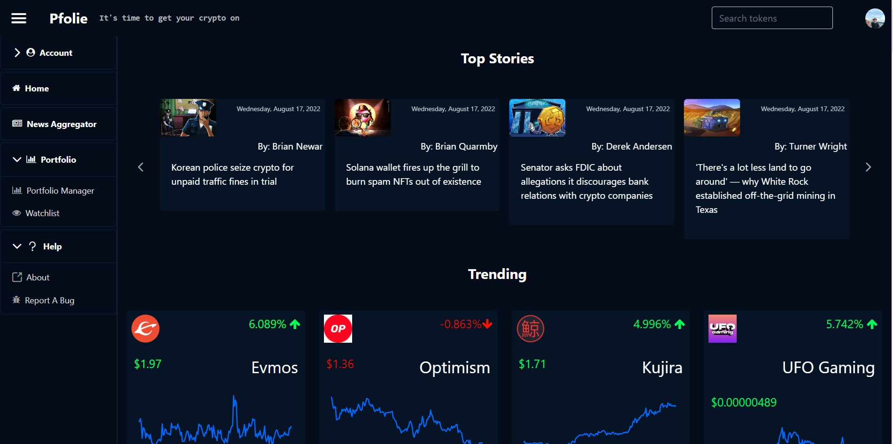
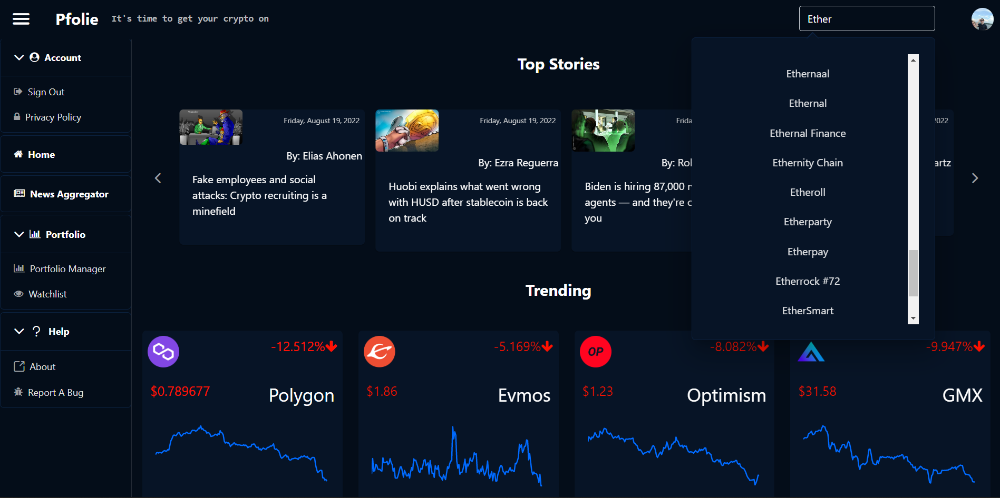
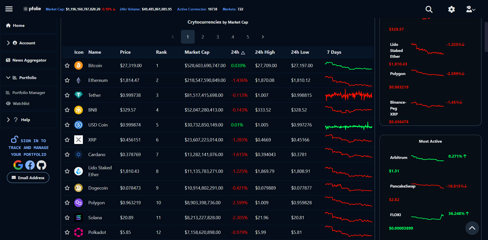
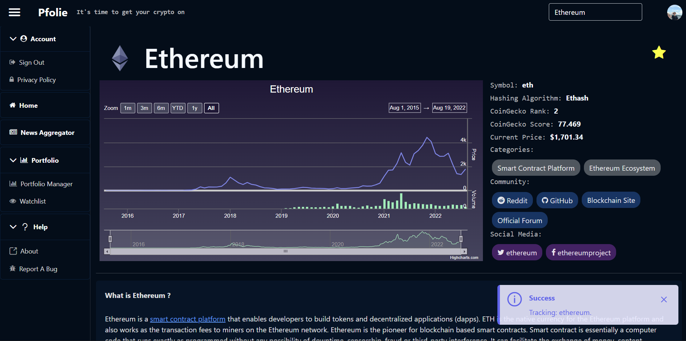
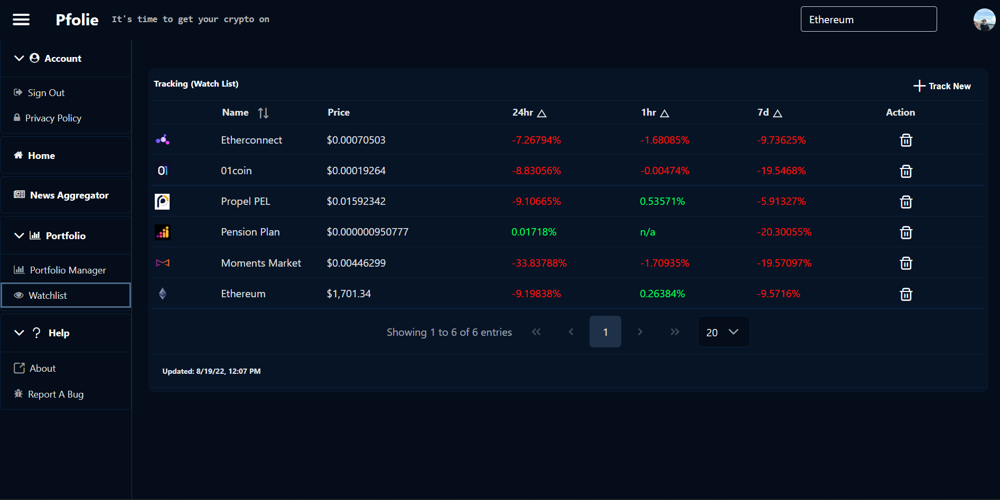
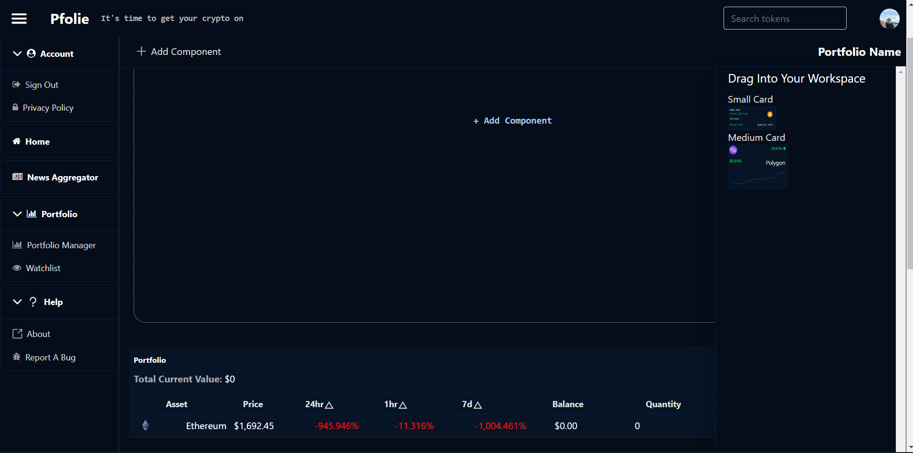
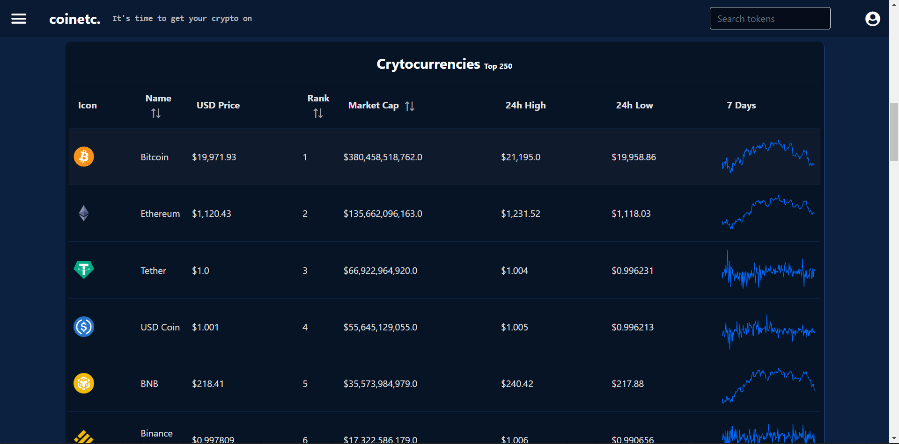
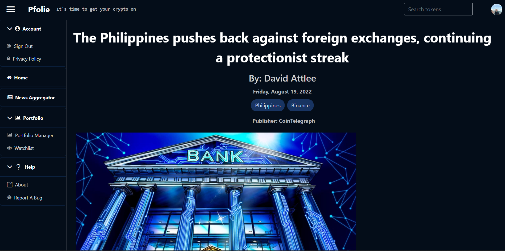

# ~ Pfolie ~
### [Pfolie.com](https://www.pfolie.com) is a suite of web-based investment and financial portfolio tools. Pfolie provides a portal for investors to interact with real-time data about financial markets. The current focus is on cryptocurrency price and market sentiment but tools for traditional financial markets are being developed.
----
____
## Features:
 - ##### Watchlist and asset tracking
 - ##### Portfolio tracking with visual insights 
 - ##### Quick search individual asset and market data
 - ##### Real-Time view of asset prices
 - ##### Market and Exchange snapshots
 - ##### News from multiple sources
 - ##### Article reader
____
### Home Page
----
### Quick Search 

----
### Real-Time Price and Market data 
----
### Historical Price and asset metadata 
----

### Create a Watchlist and Track Assets 
----
 ## Build and Track your Portfolio 
 ### Build 
### Track 

### Your Portfolio 
----
## Aggregated Market News and Sentiment
### Multiple News Sources 
### Full Articles 
----

 This work is licensed under a <a rel="license" href="http://creativecommons.org/licenses/by-nc-nd/3.0/">Creative Commons Attribution-NonCommercial-NoDerivs 3.0 Unported License</a>.----
## Local Development:
 Start everything with:
 - npm run start:local:all

