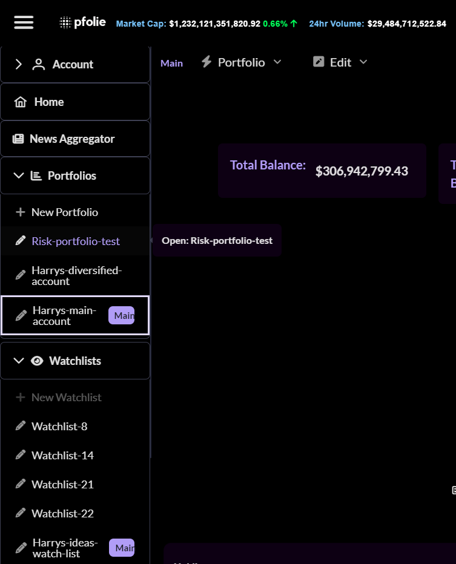

  

  
### Pfolie is a suite of web-based investment and financial portfolio tools. Pfolie provides a portal for investors to interact with real-time data about financial markets through a flexible next generation analytics dashboard. The current focus is on cryptocurrency price and market sentiment but tools for traditional financial markets are in development.**

 
----

## **Build With:**
- #### Angular 15+
- #### Node.js
- #### Express.js
- #### PostgreSQL
- #### Firebase
- #### CoinGecko API
- #### Highcharts
- #### Chart.js
____
## **Features:**
 - #### Watchlist and asset tracking
 - #### Portfolio tracking with visual insights 
 - #### Quick search individual asset and market data
 - #### Real-Time view of asset prices
 - #### Market and Exchange snapshots
 - #### News from multiple sources
 - #### Article reader
____

### **Beautiful analytics dashboard**

----
### **Quick Search** 

----
### **Real-Time price and volume charts** 

----

#### Full Screen Price +  Volume Charts + Market Share Charts

----

### **Create multiple watchlists**

----
 ## **Build and track your portfolio** 
 

 

 

----
 ## **Manage multiple portfolios** 
  

  ----

 ## **Awesome mobile experience** 

 

 

    
    
    

----
### Trending articles multiple news sources

----

## License

 This work is licensed under a <a rel="license" href="http://creativecommons.org/licenses/by-nc-nd/3.0/">Creative Commons Attribution-NonCommercial-NoDerivs 3.0 Unported License</a>.
----

## **Development**:
### **Requiements**:
- **Angular 15+ (to support standalone components)**
- **Create the following files:**
  - **API env varibles file**:
    - **../api/.env**
      - **APP_API_ROOT**=http://localhost:8080/api
      - **DATABASE_URL**={postgres-sql-connection-string}
      - **CORS_CONFIG**=https://coinetc.herokuapp.com,https://pfolie.com,https://www.pfolie.com
      - **CORS_CONFIG_LOCAL**=http://localhost:4200,http://localhost:8080
  - **The front-end env variable file:** 
    - **Create your own or reach out the project owners for dev env variables**
    - **./.env (in project root)**
      - **NG_APP_FB_API_KEY**=
      - **NG_APP_FB_AUTH_DOMAIN**=
      - **NG_APP_FB_DATABASE_URL**=
      - **NG_APP_FB_PROJECT_ID**=
      - **NG_APP_FB_STORAGE_BUCKET**=
      - **NG_APP_FB_MESSAGING_SENDER_ID**=
      - **NG_APP_FB_APP_ID**=
      - **NG_APP_FB_MEASUREMENT_ID**=
      - **NG_APP_CG_API_KEY**=
## **Run Local (Starts API and Front-end)**
 - **npm run start:local:all**
